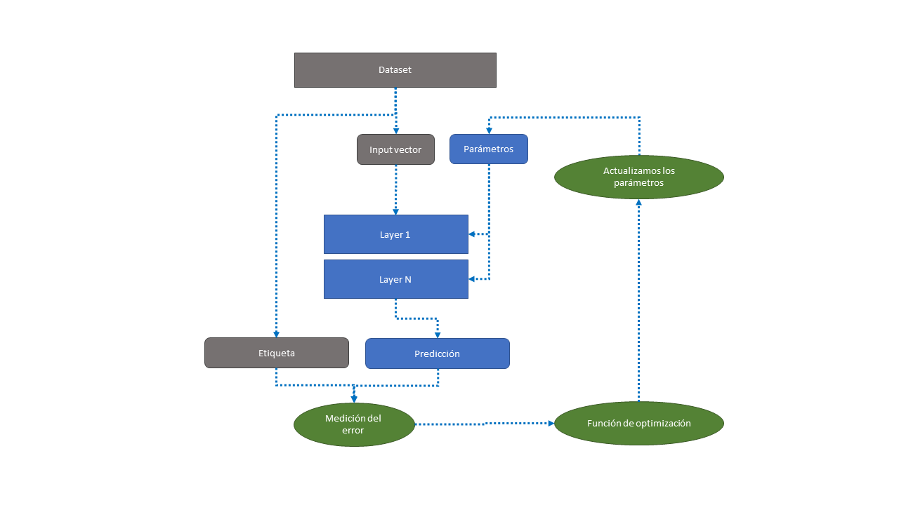
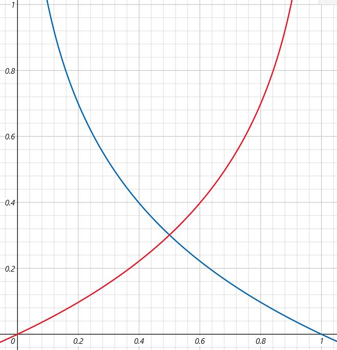

# ¿Que es una RNA? (Red Neuronal ARtificial)

Son algoritmos de ML que de alguna manera se inspiran en las redes neuronales de los seres vivos.
Actualmente están muy de moda porque ahora sí existe una gran cantidad de datos disponibles, que este tipo de redes necesitan para obtener buenos resultados, junto con el hecho de que el poder computacional es suficiente incluso en ordenadores particulares.

## El concepto de neurona M-P

La neurona de McCulloch y Pits fue la primera que se diseñó de manera artificial. Esencialmente recibe uno o más valores binarios y devuelve un único valor binario, cuyo valor dependerá del número de valores de entrada que están activos (la salida estará activa cuando el número supere un determinado threshold establecido manualmente).

Las entradas pueden ser excitadores o inhibidoras, en caso de que una entrada inhibidora esté activa, el resultado siempre será inactivo.

  
[Saber más: Neurona MP en Wikipedia](https://es.wikipedia.org/wiki/Neurona_de_McCulloch-Pitts)

Tiene algunas limitaciones importantes, por ejemplo el hecho de que los valores solo puedan ser binarios, que las entradas no puedan tener distintso pesos,  y solo permiten resolver problemas linealmente separables.

Por ejemplo puede comportarse como una puerta lógica AND porque es un problema linealmente separable:


Pero no puede comportarse como un XOR, ya que no lo es:


Estas limitaciones forzaron a nuevas versiones de neurona artificial, donde la más destacable es el __Perceptrón__.

[5.28]

## Perceptrón

El percerptrón es un diseño de neurona artificial más avanzado, que añade el concepto de peso especifico (parámetro) a cada uno de los inputs, que además no son solo binarios, sino que acepta valores reales, al igual que la salida (por lo que ya no es una salida binaria). 

El perceptrón puede no estar limitado a una única neurona, sino que puede ser una combinación de varias neuronas, en cuyo caso cada una se denomina TLU (o Threshold Logic Unit).

Además de los N inputs y sus correspondientes pesos, las TLU reciben un input adicional 0 que representa el threshold, de manera que al incluir este peso como parte de la función de agregación (z) ya no es necesario definirlo manualmente.

> z(X) = 1*W0 + X1*W1 + ... XN*WN  

Y la función de activación (a) por lo tanto siempre sería en comparación con 0

> a(z(X)) = 1 si z(X) >= 0 y 0 si z(x) < 0

Este peso generalmente se denomina __bias__ y se introduce como un input más adicional.

  
[Saber más: Perceptrón en Wikipedia](https://es.wikipedia.org/wiki/Perceptr%C3%B3n)

### Funcionamiento del Perceptrón


En el caso del Perceptrón hay dos funciones de activación que son tan habituales como simples:

* __Heaviside step function__: el resultado es 0 si el resultado de la función de agregación es menor que 0, o es 1 si el resultado de la función de agregación es mayor o igual que 0.


La otra función habitualmente utilizada en el perceptrón es:

* __Sign function__: en este caso la predicción no sería binaria. El resultado sería -1 si el resultado de agregación es menor que 0, 0 si el resultado es 0, y 1 si el resultado era mayor que 0.


### Entrenamiento del perceptrón

Para calcular los parametros del perceptron que conforman el modelo de aprendizaje (pesos w1, w2... wN y bias), en primer lugar se inicializan aleatoriamente.
Despues, cogemos alguna de las observaciones de entrenamiento y aplicamos la función de agregación y asignacion con los parametros que tengamos.
Comprobamos si el resultado de la predicción coincide con el correcto según la observación de entrenamiento.
Iterativamente, se utiliza la siguiente función para ir acercando los parametros que inicializamos aleatoriamente a valores que proporcionen cada vez resultados más acertados:

> $W_{i,j} = W_{i,j} + \eta(y_{j} - \hat{y_{j}})x_{i}$

El simbolo $\eta$ es el ratio de aprendizaje o learning rate, que es la velocidad a la que vamos a modificar los parametros para acercarnos al valor optimo. Si es demasiado alto podriamos pasarnos el valor optimo.

Vemos que, segun la formula, hay que modificar el parametro de peso $W_{i,j}$ sumandole al valor actual, el ratio de aprendizaje multiplicado por la diferencia entre el valor que hemos predicho, y el valor de la predicción correcto (el de la observación) y por el input que corresponde a la caracteristica observada.

Iterar sobre esta formula, modificando cada vez los parametros de peso, nos acercará a parametros que cada vez arrojen un numero menor de errores.

### Limitaciones

El perceptrón tiene algunos inconvenientes, por ejemplo el hecho de que no devuelve probabilidades, lo que si podría conseguirse con otras funciones de activación cuyo resultado sea un valor continuo.

Los límites de decisión son lineales, por lo que tampoco puede resolver problemas que son simples, como le ocurria a la Neurona M-P y la puerta lógica XOR.

Debido a estas limitaciones surgieron modelos de Perceptrón con más de una capa, los que se denominan Perceptron Multicapa o Multi-Layer Perceptron.

[6.36 - Perceptrón.ipynb]


## Perceptrón multicapa

El Perceptrón Multicapa, Multilayer Perceptron o Deep feedforward network es uno de los modelos más conocidos y empleados.

Es similar al perceptron simple, con la excepción de que en este caso tiene más de 2 capas, es decir, que además de su primera capa (__input layer__) y su capa de resultado (__output layer__), incluye una o más capas intermedias (__hidden layers__).


En un perceptrón multicapa, todas las neuronas (TLUs) están completamente conectadas (__Fully Connected__), es decir las entradas están conectadas a todas las salidas de la capa anterior , y sus salidas a las entradas de todas las neuronas de la capa siguiente. Además, no existen otras conexiones (por ejemplo, las salidas de una neurona nunca actuan como entrada de una neurona de una capa anterior, no existiendo por lo tando feedback o recurrencia). Por esta razón, también reciben el nombre de __Deep Feedforward Network__.

Según la mayoría de la literatura, cuando existen 2 o más capas ocultas, podemos considerar que se trata de una red neuronal profunda, por lo que un perceptrón multicapa con esta configuración se consideraría una __Red Neuronal Profunda__ o __Deep Neural Network__.

### Partes de la red

En redes neuronales como el perceptrón, tendremos ciertas partes esenciales que la forman y que a su vez son las que permiten su entrenamiento y funcionamiento.

El diagrama a continuación muestra cuales son las principales:



A modo de resumen:

* __Dataset__: es el [conjunto de datos](https://blog.findemor.es/2022-06-09-Inteligencia-artificial-flujo-de-trabajo/#datos), en este caso estoy considerando los datos con los que se realiza el entrenamiento (formados por los input vectors, características o variables independientes, y por las etiquetsa o variables dependientes de salida).
* __Layers__: las capas de neuronas, un percepton simple tendrá una capa de entrada y una de salida, mientras que los multicapa tendrán una o más capas intermedias u ocultas. Las capas están formadas por neuronas, en función del número de variables de entrada y salida, y estarán conectadas de una manera específica.
* __Parámetros__: como ya hemos ido viendo, cada una de las entradas de las neuronas lleva asignado un parámetro de peso, que en último lugar, junto con las definiciones de las funciones de agregación y activación de cada neurona, determina cómo se comportará esta. Cuando hablamos de un modelo de red neuronal nos estamos refiriendo esencialmente a la topología de la red y a los parámetros seleccionados.
* __Predicción__: introduciendo un vector de valores o input variables en la primera capa de la red, juntos con los paramámetros (pesos), obtendremos un valor resultante de salida, o predicción. 
* __Medición del error__: Para saber si la red está "acertando" o no, [existen diferentes estrategias y métricas](https://blog.findemor.es/2022-06-30-Inteligencia-artificial-validar-el-modelo/). En cualquier caso de alguna manera la medición del error consiste en identificar el grado de diferencia que hay entre el valor de la predicción que hemos obtenido para los parametros actuales, y el resultado real que deberíamos haber obtenido (que en caso de un conjunto de datos supervisado podemos conocer porque debería haber sido revisado manualmente).
* __Función de optimización__: el valor de error obtenido permite reajustar los parámetros para que el error obtenido sea cada vez menor. Existen diferentes funciones que permiten obtener nuevos parámetros actualizados para el modelo, ya hemos hablado antes de ello en la sección de [Entrenamiento del perceptrón](!!!!!!!!!!!!!!!!!!!!!!!!)
* __Actualizamos los parámetros__: al actualizar los parametros en base a los resultados de la función de optimización, logramos que el error entre el valor de la predicción y el valor real sea cada vez menor, hasta que tras un cierto número de iteraciones finalmente obtenemos resultado óptimo o suficientemente adecuado para los parámetros. En ese momento tenemos el modelo listo para ser puesto a prueba con el conjunto de test, ¡y posteriormente desplegado en producción! con observaciones nuevas cuya salida desconocemos.

### Función sigmoide

Históricamente había muchos inconvenientes para poder emplear los perceptrones multicapa por la dificultad que suponía su entrenamiento. Afortunadamente gracias a un cambio en la función de activación, que hasta entonces [era la heaviside step function o la sign function](!!!!!!!!!!!!!!!!!!!!!!!!!!!!!!!!!!!!!!!!!), por una nueva función, la __sigmoide__, lo que abría las puertas a un nuevo método de entrenamiento basado en el algoritmo conocido como __backpropagation__.

> $sigmoid(z) = \frac{1}{1 + e^{-z}}$


Una de las diferencias más importantes con respecto a la función heaviside, es el hecho de que el resultado no es discreto (0 o 1) sino que es un valor continuo, que además podremos interpretar como la probabilidad de que el resultado sea positivo.

Existen otras funciones además de la __sigmoide__ que se emplean actualmente muy a menudo, como la __ReLU__ o la __tangente hiperbólica__.

[7.46 tengo codigo e imagenes dle limite d edecision de ambas] a diferencia del límite de decisión del perceptrón simple, el perceptrón multicapa es capaz de definir límites de decisión que pueden separar conjuntos de datos de manera no lineal.

## Optimización de Redes Neuronales

Al igual que ocurre con otros algoritmos de Machine Learning, las Redes Neuronales emplean una función de coste y una función de optimización para el cálculo del error y, por lo tanto, para la optimización del modelo.


### Función de coste

La función de coste calcula el valor del error entre la predicción obtenida y el valor real esperado según lo que teníamos en las observaciones de entrenamiento.

Al emplear una función sigmoide como función de activación, obtendremos valores reales entre 0 y 1, por ejemplo, 0.9. Si el valor observado pertenecía a la categoría, esperabamos un resultado de 1, sin embargo al obtener 0.9, esto indicaba una probabilidad muy alta de pertenecer a la clase.
Nuestra función de coste devolverá la diferencia, es decir 0.1 = 1 - 0.9, que es un valor pequeño. Sin embargo, si la clase hubiese sido 1 pero nuestro algoritmo hubiese predicho 0.6, por ejemplo, habria devuelvo 0.4, indicando que el resultado tenia un error más alto.

Es decir, si el valor esperado (etiqueta real) fuese 1, por ejemplo, el resultado de la función de coste deberia ser 1 cuando la predicción sea 0, y deberia ser 0 cuando la predicción sea 1. Para cualquier otro valor de predicción será más pequeño cuanto más se acerque a 1. Esto lo podríamos aproximar con una función del tipo (en azul en la gráfica):

> $ferr( \hat{y},y ) = -\log(\hat{y})$

Para la función de coste de las clases con etiqueta real 0, sería el espejo de la anterior (en rojo en la grafica):

> $ferr( \hat{y},y ) = -\log(1 - \hat{y})$



Podemos combinar las funciones de error para obtener una única valida tanto para los casos donde la predicción sea **y = 1** como los que sea 0 de este modo:

> $ferr( \hat{y},y ) = -(y\log(1 - \hat{y}) + (1-y)\log(1 - \hat{y}))$

Con esta función podríamos evaluar el error en cada una de las observaciones independientemente de su etiqueta **y**.

**Función de error final**

Para poder calcular el error global para todas las observaciones, bastaria con recorrer todo el conjunto de datos, calcular y sumar el error de cada observación calculado con la fórmula anterior y dividir el resultado entre el número de observaciones.


> $ferr( \hat{y},y ) = -\frac{1}{m} \sum_{i=1}^m (y^{i}\log(1 - \hat{y^{i}}) + (1-y^{i})\log(1 - \hat{y^{i}}))$

El resultado de computar esta función con todas las observaciones, nos proporciona un resultado que corresponde con el error concreto que tiene nuestro modelo configurado con los parámetros actuales. 

> Una función de coste popular en la literatura es la función **Cross Entropy Loss**, muy similar a la presentada aquí.

El objetivo, por lo tanto, será **encontrar unos parámetros tales que minimicemos el resultado de esta función de error**, precisamente para lo que emplearemos la **Función de optimización**.

### Función de optimización

La función de optimización tiene como objetivo coger el valor de error que hemos calculado para los parámetros actuales y el conjunto de datos, y genera una versión actualizada de los parámetros de tal manera que el error se reduzca. Iterar sobre este proceso permitiria alcanzar unos parámetros tales que se minimice el valor de la función de error.

La función de optimización más popular en el campo del Machine Learning y de la Inteligencia Artificial en general, es la **Función de Gradiente Descendente** o **Gradient Descent**.

La función de error, que relaciona el error con cada valor de los parámetros de peso W, es convexa, tendrá un minimo global que serán los valores óptimos para los parametros de peso. Sin embargo, tambien podría ocurrir que la función no sea convexa y pueda tener múltiples minimos locales que dificulten identificar el mínimo global.


#### Forma de trabajo

Como al principio de la evaluación desconocemos donde está el minimo global, inicializamos los parámetros de manera aleatoria.

A continuación cogemos el valor asignado al parámetro W y lo va a actualizar al mismo valor menos un ratio de aprendizaje multiplicado por la derivada de la función de error respecto al valor del parametro.

> $W = W - \eta\frac{dferr}{dW}$

La fracción de la derivada de la función de error en función de W será un valor positivo o negativo en función de si estamos en una pendiente positiva o negativa, con lo que reducirá o aumentará el valor de W en función de si la pendiente de la funcion de error asciende o desciende, siempre descendiendo hacia el minimo global (de ahí recibe su nombre).

Este incremento o decremento de W será mayor o menor en función del valor que demos al hiperparametro del ratio de aprendizaje. Si es muy grande, podríamos no encontrar el minimo global, pero si es muy pequeño, se requeriran muchas iteraciones para desplazarnos por la curva hasta encontrarlo y será propenso a caer en minimos locales.

El Gradiente Descendiente consiste en repetir esta operación de actualización de los parametros y medición del error hasta que la variación en los parametros sea 0 o casi 0.


## Clasificación, output layer y función de activación

El perceptrón multicapa puede emplearse para predecir valores discretos, es decir, un conjunto finito de opciones. Por ejemplo, podemos predecir un único valor teniendo una única neurona en la Output Layer, que estará activa o no, función de si pertenece a esa clase. 

También existe la opción de predecir un conjunto de valores discretos al mismo tiempo, simplelemente teniendo en esta última capa una neurona por cada uno de los valores a predecir.

Esto permite que las redes de tipo perceptrón multicapa puedan utilizarse para __problemas de clasificación__. Cuando la clasificación sea __binaria__ (una única neurona que indica la pertenencia o no a la clase positiva), lo más habitual es utilizar la _función de activación sigmoide_. El resultado de esta función será un valor decimal que puede interpretarse como la probabilidad de que pertenezca a la clase positiva.

En algunos casos podemos desear realizar varias __clasificaciones binarias simultaneamente__ (como decía antes, configurando dos neuronas en la output layer, __ambas con función de activación sigmoide__). Por ejemplo a partir de una fotografia de una persona podríamos querer hacer una clasificación binaria de si es rubio/moreno y si es mujer/hombre (dos clasificaciones binarias independientes pero simultaneamente).

En este caso, nuestras etiquetas para el entrenamiento deberán ser vectores con dos valores, y nuestra output layer tendrá 2 neuronas, cada una encargada de predecir el valor correspondiente del vector.

Por ultimo, puede que lo que nos interese sea realizar una __clasificación multiclase__. Podríamos emplear el ejemplo del párrafo anterior donde cada neurona represente la pertenencia o no a cada una de las clases, escogiendo aquella con un valor de la función de activación sigmoide más alto, pero sería mucho más adecuado disponer de un mecanismo que directamente nos arroje directamente la pertenencia a una clase en particular. Para conseguirlo, tendremos que tener en la output layer tantas neuronas como clases deseemos predecir, y donde emplearemos una __función de activación softmax__. Cada neurona arrojará una probabilidad, y una característica de este tipo de redes es que además la suma de todos los resultados de las neuronas de la output layer será 1.

En resumen:
* **Clasificación binaria**: una sola neurona en la output layer, empleando funcion de activación sigmoide.
* **Clasificación binaria multietiqueta o Multilabel binary Classification**: varias neuronas en la output layer, todas ellas con función de activación sigmoide (equivalente a varias clasificaciones binarias simultaneas).
* **Clasificación multiclase o Multiclass Classification**: varias neuronas en la output layer (una por cada posible clase) con función de activación softmax.

### Clasificación multiclase (Softmax Regression)

Este es un problema muy habitual que consiste en clasificar un conjunto de datos en varias clases, por ejemplo: perro/gato/ave/pez.

Como he descrito anteriormente, este tipo de problemas emplea una función de tipo softmax, con un número de neuronas en la output layer igual al numero de clases posibles, en este caso 4.

Cada neurona arrojará una probabilidad de que los datos de entrada pertenezcan a una clase. Por ejemplo, la primera neurona en la output layer entregará un valor P(1/X) que es la probabilidad de que los datos de entrada pertenezcan a la clase 1 (perro). La suma del resultado de todas las neuronas de la output layer será 1.

> A diferencia de la función de activación sigmoide, la función de agregación softmax necesita, para ser computada, el resultado de la función de agregación de todas las neuronas de la output layer. Esto es debido a que la formula de calcular el resultado de cada neurona es dividir el exponencial de la función de agregación de esa neurona entre la suma de los exponenciales de las funciones de agragación de todas las neuronas de la output layer. Esta es la razón por la que el resultado de la suma de todas las neuronas será 1.

La función de error, cuando se emplea la función softmax, también cambia.

Hay que tener en cuenta que en los datos de entrenamiento multiclase, entre 4 posibles clases, __"y"__ (la etiqueta de entrenamiento supervisada) será un vector que indica la pertenencia con valores entre 0 y 1, y cuya suma debe ser 1. Por ejemplo, una observación de la clase perro tendra __y = [1, 0, 0, 0]__ y una de la clase ave será __y = [0, 0, 1, 0]__. A diferencia de la clasificación binaria y la función sigmoidea, donde había un único valor.

Por esta razón, la función de error contemplará la distancia entre la predicción y el valor de entrenamiento para cada una de las clases posibles, empleando la formula: 

> $ferr( \hat{y},y ) = - \sum_{j=1}^4 (y_j\log(\hat{y_j}))$

Esta funcion arrojará un valor más alto cuanto más cercano a 0 sea el valor predicho $y_j$ como probabilidad de pertenencia a la clase cuya $\hat{y_j} = 1$ en los datos de entrenamiento supervisados.

## Regresión, output layer y función de activación

Las redes neuronales profundas no están limitadas a casos de clasificación donde los valores de la predicción son discretos (como veiamos en los parrafos anteriores), sino que también pueden emplearse en casos de Regresión, es decir, donde la variable que intentamos predecir es un valor continuo.

En esos casos, cuando queremos predecir un único valor, la output layer tendrá una única neurona, y cuando queremos predecir varios valores continuos al mismo tiempo, tendremos en esta última output layer tantas neuronas como valores deseemos predecir. En ambos casos, para conseguirlo, no emplearemos función de activación en las neuronas de la output layer, permitiendo así que estas den como resultado cualquier valor. el resultado de las neuronas será por lo tanto el resultado de la función de agregación, que es un valor continuo.

Si queremos acotar el rango de los valores de salida de la output layer, por ejemplo limitandola unicamente a valores positivos, podemos usar funciones de activación específicas como la __función de activación ReLU__.

Por último, la función de error que se utiliza en los casos de regresión será la __función de error cuadrático medio__ que se corresponde con la fórmula:

> $ecm = \frac{1}{m} \sum_{i=1}^m (\hat{y_i} - y_i)^2$

Que representa la diferencia acumluada entre los valores predichos y los reales para las observaciones de entrenamiento.

En resumen:

* **Regresión de un único valor**: output layer con una única neurona sin función de activación.
* **Regresión de varios valores simultáneamente**: output layer con la misma cantidad de neuronas que el numero de valores a predecir, sin funciones de activación.
* **Regresión de un valor con rango acotado**: output layer con la misma cantidad de neuronas que el número de valores a predecir, con función de activación ReLU.

# Libreria Keras para Python

La [librería Keras](https://keras.io/) es una de las más famosas y potentes a la hora de trabajar con redes neuronales profundas. Con Keras vamos a poder construir y entrenar redes neuronales así como ejecutar y evaluar los resultados de nuestros modelos.

Keras es una libería open source que se construye sobre otras bien conocidas como TensorFlow, pero ofreciendo una APIs abstractas y de alto nivel que resultan mucho más sencilla de utilizar para el usuario humano.

Hablo en plural porque Keras ofrece dos APIs:
* __Secuential API__: más sencilla, adecuada para los casos en los que cada capa tiene un solo tensor de entrada y salida.
* __Functional API__: para casos a los que la Secuential API no llega:
  * Cuando alguna de las capas tiene varias entradas o salidas.
  * Cuando hay que compartir capas, o emplear un modelo no secuencial (no lineal).

## Crear una red neuronal en Keras

Para implementar un modelo de red neuronal en Keras, necesitaremos en primer lugar __tres conjuntos de datos__, uno para el entrenamiento, otro para el test y otro de validación. En el caso de Keras, estas observaciones deben definirse como vectores, que se introducirán en la libreria como vectores de entrada y salida.


```python
import tensorflow as tf
from tensorflow import keras

print("tensorflow version: ", tf.__version__)
print("keras version:      ", keras.__version__)

from tensorflow.keras import datasets
from sklearn.model_selection import train_test_split

mnist = datasets.mnist #clasico dataset de numeros escritos a mano

(Xtrain, Ytrain), (Xtest, Ytest) = mnist.load_data()
Xtest, Xvalidation, Ytest, Yvalidation = train_test_split(Xtest, Ytest, test_size = 0.5)

```

A continuación describimos la arquitectura de la red neuronal __estableciendo los hiperparámetros__, es decir, el número de capas, número de neuronas por capa, etc. El bloque elemental para la construcción de la red es la _layer_. Las _layer_ contienen neuronas, cuya cantidad se establece al definir la capa. Las _layer_ se apilan y conectan secuencialmente.

La primera capa oculta que se define, recibe como parametro la forma de la input layer, por lo que no es necesario definir esta por separado.

```python
from tensorflow.keras import models
from tensorflow.keras import layers

network = models.Sequential()
# añadimos capas a la arquitectura vacia a continuación

# layers.Dense define que nuestras neuronas estarán conectadas todas con todas
# 300 neuronas en la primera capa
# escogemos una función de activación ReLU
# el vector de datos de entrada (input layer) tendrá 28*28, es decir un parametro por cada pixel de las imagnees mnist
network.add(layers.Dense(300, activation='relu', input_shape=(28*28,)))
# creamos una segunda capa oculta
network.add(layers.Dense(100, activation='relu'))
# creamos la output layer, se trata de un clasificador multiclase con 10 posibles valores
# por lo que usamos 10 neuronas y función de activación softmax como hemos visto anteriormente
network.add(layers.Dense(10, activation='softmax'))


# obtenemos un resumen de la arquitectura que hemos definido
network.summary()

# podemos examinar los pesos y terminos bias
# network.layers
# hiddenlayer1 = network.layers[1]
# weights, biases = hiddenlayer1.get_weights()
```

Estableceremos también las __funciones de error y optimización__. La función de error permite medir qué tal se está comportando el modelo y permite tomar decisiones para corregir desviaciones. La función de optimización determina como deben ser modificados los parametros (pesos y bias) para reducir el error devuelto por la función de error. 

Tambien podemos especificar qué métricas queremos utilizar durante el entrenamiento para que se nos notifique qué tal va el proceso y como de cerca estamos de una solución óptima, o si hemos caido en un problema de overfitting.

```python
network.compile(
    loss='categorical_crossentropy', #entropy loss
    optimizer='sgd', #gradient descent
    metrics=['Precision','accuracy']
)
```

Una vez tenemos esto, ya solo queda entrenar la red utilizando el conjunto de datos de entrenamiento y evaluar sus resultados con el conjunto de test.

```python
#transformamos las matrices de 28*28 en vectores usando reshape
Xtrain_prep = Xtrain.reshape((60000, 28*28))
Xtrain_prep = Xtrain_prep.astype('float') / 255 #normalizamos los valores para que se mantengan en el rango de 0 a 1

#hacemos lo mismo con el resto de conjuntos 
Xtest_prep = Xtest.reshape((5000, 28*28))
Xtest_prep = Xtest_prep.astype('float') / 255
Xvalidation_prep = Xvalidation.reshape((5000, 28*28))
Xvalidation_prep = Xvalidation_prep.astype('float') / 255

# las caracteristicas de salida originales son un vector con el valor supervisado, en la forma [1, 0, 5, 7...]
# como estamos usando categorical_crossentropy y softmax, debemos convertirlas a vectores donde la posición correspondiente a la categoría sea un 1, y el resto sean 0's
# por ejemplo para 1 = [1, 0, 0, 0...], 2 = [0, 1, 0, 0...]
from tensorflow.keras.utils import to_categorical

Ytrain_prep = to_categorical(Ytrain)
Ytest_prep = to_categorical(Ytest)
Yvalidation_prep = to_categorical(Yvalidation)


# Entrenamos la red neuronal
h = network.fit(
    Xtrain_prep,
    Ytrain_prep,
    epochs=40, #numero de iteraciones que usara gradient descent
    validation_data=(Xvalidation_prep, Yvalidation_prep)
)
## es importante notar que cada vez que ejecutemos esto, la red comenzará a entrenar desde el ultimo valor de los parametros que tenga, y no lo hará desde cero.

# La variable h permite almacenar el valor de los parámetros al final del entrenamiento, la información de los epochs, y los errores que se hayan producido en cada epoch.

# Podríamos representarla graficamente
 import pandas as pd
 import matplotlib.pyplot as plt
 pd.DataFrame(h.history).plot(figsize=(10, 7))
 plt.gca().set_ylim(0, 1.2)
 plt.xlabel("epochs")
 plt.show()

```


Podemos ver como se ha ido reduciendo el error en el conjunto de entrenamiento y validación (loss y val_loss). 

Hay que tener en cuenta que si el error del conjunto de entrenamiento se reduce pero el del conjunto de validación aumenta, significaría que se está produciendo un overfitting (para detectar esto es precisamente para lo que empleamos el conjunto de validación) 

Si detectamos este problema, u otro por el que no estamos satisfechos con el modelo, tendremos que empezar a jugar con la configuración de la red, modificando el número de capas, de neuronas por capa, las funciones de activación, etc. hasta dar con el resultado deseado.

Una vez tenemos un modelo con el que estamos satisfechos, podemos validar el resultado con el conjunto de test:

```python
# Validamos con el conjunto de test

test_loss, test_accuracy, test_precision = network.evaluate(Xtest_prep, Ytest_prep)

print('test_loss:      ', test_loss)
print('test_accuracy:  ', test_accuracy)
print('test_precision: ', test_precision)

```

### Prediccion y explotación del modelo

Finalmente podemos utilizar el modelo para predecir nuevas observaciones.

```python
Xnew = Xtest[51] #seria uno nuevo, pero por simplificar la demostración uso uno que ya existe

# podemos representar la imagen cargada
import numpy as np
plt.imshow(np.reshape(Xnew, (28,28)), cmap=plt.cm.gray)
plt.show()
```


```python
# primero preprocesamos los nuevos datos de forma identica a como lo hicimos durante el entrenamiento
# ya que tenemos que entregar los datos conforme a como ha sido entrenado el modelo

Xnew_prep = Xnew.reshape((1, 28*28))
Xnew_prep = Xnew_prep.astype('float32') / 32

# realizamos la predicción
Ynew_pred = network.predict(Xnew_prep)

# mostramos el vector de salida (redondeado a dos decimales para mayor claridad)
Ynew_pred.round(2) 
```

Donde la salida es un vector con la probabilidad de pertenencia de los datos a cada clase:

> array([[0., 0., 0., 0., 0., 0., 0., 0., 1., 0.]], dtype=float32)

Podemos ver que en este caso, de manera acertada, la probabilidad de que pertenezca a la clase 8 es de 1.

Tambien podríamos haber obtenido directamente la clase con mayor probabilidad, en lugar de un vector, empleando la funcion argmax:

```python
np.argmax(network.predict(Xnew_prep), axis=-1)
```

Obteniendo directamente el resultado de la predicción, 8:

> array([8], dtype=int64)

Como último paso, podemos exportar el modelo entrenado para poder emplearlo en otro momento o en otros sistemas. Al guardar el modelo, guardaremos tanto la arquitectura definida por nosotros, como los parámetros e hiperparámetros y las metricas que permiten comprender su capacidad predictiva.

Lograr esto es tan facil como lanzar la siguiente instrucciön:

```python
network.save("modelo_clasificacion_digitos"
```

El fichero generado puede ser importado en muchos otros sistemas, o en python usando estas instrucciones:

```python
from tensorflow.keras.models import load_model
modelo_pre_entrenado = load_model("modelo_clasificacion_digitos")
```


## Funciones de activación

En textos anteriores he escrito acerca de las funciones de activación básicas que podemos emplear en una red neuronal, como la sigmoide (para clasificación binaria), la softmax (para clasificación multiclase), o incluso no usar función de activación (para la regresión).

Sin embargo existen otras funciones de activación que también se emplean mucho en ciertos casos y que conviene conocer.

### Función de tangente hiperbólica, tanh(z)

La formula correspondiente es:

> $tanh(z) = \frac{e^z-e^{-z}}{e^z + e^{-z}}$

Y su representación:


Como puede apreciarse, a diferencia de la función sigmoide (con valores entre 0 y 1) esta función es capaz de manejar valores negativos (entre -1 y 1). Por este motivo, __pude ser más adecuada para las capas ocultas intermedias__ (es decir, las hidden layer salvo la output layer, que para clasificación binaria seguirá usando la función sigmoide).

### Función Rectificador, o ReLU(z)

El problema de las funciones de activación sigmoide y tanh es que para valores absolutos muy grandes de la función de agregación z, la función está cerca de su limite, por lo que es muy "horizontal", lo que quiere decir que la pendiente es muy pequeña. Como durante el entrenamiento empleamos __gradient descent__ que precisamente se basa en corregir los parametros empleando la pendiente (que calculamos gracias a la derivada), las modificaciones de los parametros pueden ser muy pequeñas en estos casos, haciendo que el proceso sea muy lento.

Para evitar este problema, se emplean habitualmente otras funciones, como es el caso de la función de activación __ReLU(z)__, que viene dada por la fórmula:

> $ReLU(z) = max(0,z)$

Su representación gráfica sería así (en azul):


El resultado siempre estará entre 0 y Z, y la pendiente es constante, evitando el problema anterior.

### Función Leaky ReLU(z)

La función ReLU(z) introduce un pequeño inconveniente, y es que para valores menores a 0, la pendiente es 0. Para evitar este efecto, existe otra función denominada __leaky ReLU__:

> $LeakyReLU(z) = max(0.01 * z,z)$


Sin embargo, en la práctica, las funciones de agregación de las capas ocultas de la red neuronal suelen devolver siempre valores mayores o iguales a 0, por lo que usar ReLU o LeakyReLU no supone mucha diferencia, y suele utilizarse más ReLU.

## En resumen

Lo más adecuado será utilizar la función __ReLU__ (o Leaky ReLU) como funciones de activación de las neuronas de __todas las capas intermedias__, y la función __Sigmoide para las de la output layer__ (cuando se trate de un problema de __clasificación binaria__) o bien __Softmax en la output layer__ (cuando sea un problema de __clasificación multiclase__).

# Funciones de optimización

Ya hemos hablado de la función de optimización más famosa, la Función de Gradiente Descendente o Gradient Descent. Sin embargo, existen muchas otras funciones que persiguen el mismo propósito pero de distinta manera, consiguiendo diferentes resultados que pueden resultar adecuados en según que casos.

## Gradient Descent

Este algoritmo realiza la predicción de nuestro modelo para cada uno de los casos de ejemplo, y gracias a ello calcula el error acumulando, siendo este error las diferencias entre estas predicciones y las correspondientes etiquetas supervisadas de cada uno de los ejemplos. Por ultimo, este error acumulado se divide entre el número de ejemplos de entrenamiento. El algoritmo trata de modific


Sin entrar más en detalles sobre el funcionamiento, hay algo en lo que hay que fijarse, y es que este algoritmo requiere recorrer todos y cada uno de los ejemplos del conjunto de datos de entrenamiento para cada actualización de los parámetros, lo que puede no resultar idóneo cuando estamos trabajando con conjuntos de datos muy grandes, de millones de ejemplos, algo que es bastante normal.


## Mini-batch Gradient Descent

Este algoritmo es similar al anterior, con la principal diferencia de que intenta subsanar ese inconveniente que surje con los conjuntos de datos muy grandes, dividiendo el conjunto de datos de ejemplo que se emplea durante el entrenamiento en subconjuntos más pequeños de N elementos (__mini-batches__).

Durante la ejecución del algoritmo, cada iteración de actualización se realizará utilizando uno de estos subconjuntos o mini-batches distintos (en cada iteración calculamos el error basandonos únicamente en los ejemplos que incluye un solo minibatch). 

Despues de cada iteración se selecciona el siguiente mini-batch. __Cada vez que el algoritmo ha recorrido todos los mini-batches que conforman el conjunto de datos completo, decimos que ha ocurrido un _epoch___.

El __epoch__ es uno de los parámetros más frecuentes que vamos a encontrar en la configuración de los modelos de aprendizaje profundo, por lo que es importante saber a que hace referencia.

### En python

Cuando hacemos el fit para entrenar un modelo en Python, quiza hayas advertido que de hecho, por defecto se emplea el algoritmo de __Mini-Batch Gradient Descent__. De hecho, en el resultado se nos informa de ello (extraido del ejemplo completo que vimos en este artículo):

```python
# Entrenamos la red neuronal
h = network.fit(
    Xtrain_prep,
    Ytrain_prep,
    epochs=40, #numero de iteraciones que usara gradient descent
    validation_data=(Xvalidation_prep, Yvalidation_prep)
)

## Resultado

Epoch 1/40
1875/1875 [==============================] - 8s 4ms/step - loss: 0.5715 - precision: 0.9415 - accuracy: 0.8525 - val_loss: 0.3143 - val_precision: 0.9386 - val_accuracy: 0.9082
Epoch 2/40
1875/1875 [==============================] - 6s 3ms/step - loss: 0.2756 - precision: 0.9446 - accuracy: 0.9219 - val_loss: 0.2500 - val_precision: 0.9470 - val_accuracy: 0.9296
```

Podemos ver la precisión alcanzada en cada uno de los Epoch, es decir, cada vez que se ha recorrido completamente todo el dataset.
Además, en cada epoch vemos el número de Mini-batches que se han recorrido en cada epoch (1875 en el ejemplo anterior). 
Si queremos saber que tamaño de Mini-batch se está utilizando (cuantos ejemplos hay en cada Mini-batch), bastaría con dividir el número de ejemplos en el conjunto de ejemplos completo entre el número de Mini-batches: 60000 / 1875 = 32.

Es decir, que por defecto se están usando mini-batches de tan solo 32 elementos.

Podríamos cambiar el número de elementos por mini-batch (y por lo tanto el número de mini-batches), incorporando el parámetro __batch_size__:

```python
h = network.fit(
    Xtrain_prep,
    Ytrain_prep,
    batch_size=256, #aumentamos el numero de elementos en los mini-batches
    epochs=40, #numero de iteraciones que usara gradient descent
    validation_data=(Xvalidation_prep, Yvalidation_prep)
)
```

Cuanto mayor sea el número de elementos en los mini-baches, podría ir más deprisa, porque estamos haciendo un menor numero de actualizaciones en los parametors en cada epoch.

Si los mini-batches son pequeños, además, la función de error descenderá de manera menos estable, y podría ser más propenso al over-fitting. Esto se debe a que en cada iteración la función siempre reduce el error, mientras que en el mini-batch estamos considerando solo el error de un pequeño conjunto, pero puede ser mayor el error con un conjunto diferente (aunque la tendencia general será a reducirse igualmente con cada epoch).

Es interesante conocer estas cosas que perdemos al no procesar el conjunto de datos completo como sí hace el Gradient Descent.

#### Elegir el tamaño del Mini-batch

Lo ideal es que el tamaño del Mini-batch entre en la memoria del procesador que estemos empleando, de manera que la CPU tenga disponible todos los ejemplo de cada Mini-batch en cada iteración.

Por esta razón, los valores que mejor suelen funcionar son __32, 64, 128, 256 o 512__, y para escoger el adecuado podemos hacer los cálculos o simplemente probar.

Sin embargo, en la práctica, se ha detectado que para que el modelo se comporte de forma estable, los mini-batches deberían tener un tamaño de entre 2 y 32 elementos, por lo que generalmente __32 es la opción favorita__ y de hecho es la que Keras establece por defecto.

__En resumen:__

* __Mini-batch__: subconjunto de N elementos de ejemplo, obtenido a partir del conjunto de dataset completo.
* __Epoch__: representa una iteración sobre los ejemplo de un dataset de entrenamiento completo de M elementos.
* __Iteración__: cada vez que se calcula el error acumulado para unos ciertos parametros usando los datos de un mini-batch, se considera una iteración. En un Epoch habrá, por lo tanto, M/N iteraciones.

## Descenso de gradiente estocástico (Stochastic Gradient Descent)

Es una variante del Mini-batch Gradient Descent, en el que el mini-batch tiene un tamaño de exactamente 1 elemento.

Es decir, en este caso el algoritmo va a calcular el error para un colo elemento del conjunto de datos, va a modificar los parametros de acuerdo al error obtenido, y así sucesivamente en cada iteración con un elemento del conjunto diferente, hasta haber recorrido todo el dataset, completando un epoch.

Esta función minimiza el resultado de la función de error de manera global y con un recorrido muy inestable, pero a diferencia de los demás, generalmente no llegará a encontrar los parámetros óptimos (a converger en el minimo error).


```python
h = network.fit(
    Xtrain_prep,
    Ytrain_prep,
    batch_size=1, # Basta con establecer el tamaño de mini-batch a 1 elemento
    epochs=40, #OJO que cada epoch llevará mucho tiempo, aunque el algoritmo, en general, obtendrá parametros "optimos" de manera más rápida.
    validation_data=(Xvalidation_prep, Yvalidation_prep)
)
```

En la imagen a continuación vemos el recorrido del Gradient Descent (a la izquierda) vs el del Stochastic Gradient Descent (a la derecha) y notamos que no llega a converger.


[Créditos: Image from Researchgate.net](https://www.researchgate.net/figure/A-plot-of-the-gradient-descent-algorithm-left-and-the-stochastic-gradient-descent_fig1_303257470) publicación [Fast Online Training of L1 SVM by Gabriela Melki](https://www.researchgate.net/publication/303257470_Fast_Online_Training_of_L1_Support_Vector_Machines)

### Momentum

Gradient Descent with Momentum es una variación de Gradient Descent que consiste básicamente en aplicar la técnica conocida como Media Movil (Exponentially Weighted Moving Average o EWMA) para suavizar la curva que describe la función de error con cada iteración de variación de los parámetros de la red neuronal.

Con EWMA es necesario añadir un hiperparámetro más al modelo, el término Beta, con un valor entre 0 y 1, que indica cuántos valores anteriores al actual se van a tener en cuenta para calcular la media (y por lo tanto suavizar) el valor actual, que luego será el que se emplee junto al valor Learning Rate para llegar al los valores óptimos de forma más directa, sin tantos "bandazos".

Simplificando mucho, el número de resultados anteriores que se tendran en cuenta puede calcularse con la formula $\frac{1}{1 - \beta}$, por lo que para un valor de 0.9, se tendrán en cuenta los 10 valores anteriores.

Podeis aprender más en estos enlaces sobre [Media móvil](https://es.wikipedia.org/wiki/Media_m%C3%B3vil) o [Momentum](https://ruder.io/optimizing-gradient-descent/index.html#momentum).

### Root Mean Squared Propagation (RMSprop)

Variación de Momentum con algunas diferencias en el cálculo de las actualizaciones de los parámetros de la red neuronal. RMSprop utiliza el cuadrado de los pesos durante el cálculo, pudiendo llegar un poco más rapido que Momentum al valor óptimo.

Requiere un parametro adicional Épsilon, que suele ser muy pequeño (del orden de 10^-7) para evitar la división por 0 durant el proceso de actualización de los parámetros.

En [este enlace](https://keras.io/api/optimizers/rmsprop/) podeis ver todos los parámetros que acepta la librería Keras para esta función de optimización, y en [este otro enlace](https://machinelearningmastery.com/gradient-descent-with-rmsprop-from-scratch/) se explica más en detalle.

### Adaptive Movement Estimation (Adam)

Es una combinación de las dos técnicas anteriores, Momentum y RMSprop, donde se emplea tanto el valor sin elevarlo al cuadrado y elevandolo como parte de la formula que adapta los parámetros de peso de la red neuronal.

Emplear esta técnica hace que no exista una learning rate más adecuado, sino que habrá que hacer pruebas hasta encontrar el que mejor funcione.
[El paper donde se especifica este algoritmo](https://arxiv.org/abs/1412.6980) se recomiendan además un valor de 0.9 para $\beta_1$ y 0.999 para $\beta_2$, así como un valor de épsilon de 10^-8. 

En [este enlace](https://machinelearningmastery.com/adam-optimization-from-scratch/) hay una explicación completa del algoritmo.

### Qué función de optimización elegir


[Créditos: image from https://imgur.com/a/Hqolp#NKsFHJb](https://imgur.com/a/Hqolp#NKsFHJb)

Vamos a resumir entonces las ventajas y desventajas de cada algoritmo:

* __Gradient Descent__: _El mejor en conjunto de datos pequeños._
    * Es __la más más lenta__ y pesada, ya que recorre todos los elementos en cada iteración.
    * Cada iteración reduce el error.
    * Suele obtener unos __parámetros óptimos__.
* __Mini-Batch Gradient Descent__: _Adecuado en conjuntos grandes, de varios millones de elementos._
    * Procesa un subconjunto de datos en cada iteración, por lo que es __más rápida que la anterior en conjuntos muy grandes__.
    * Generalmente alcanza los __parámetros óptimos__ aunque en un camino un poco más largo.
* __Stochastic Gradient Descent__: _Adecuado cuando el conjunto de datos es inmenso y tenemos poca potencia de cómputo._  
    * Procesa tan solo un elemento en cada iteración, __por lo que hace modificaciones de los parámetros de manera más rápida que las otras__.
    * Lo más probable es que __no encuentre los parametros óptimos__ pero si se acerque mucho a ellos.
* __Momentum__: _Es más rápido que mini-batch pero aún capaz de encontrar valores óptimos_.
    * Aplica EWMA para dirigirse a los parámetros óptimos de manera más directa.
    * Requiere escoger y ajustar un hiperparámetro adicional Beta que indica cuantos valores anteriores se usaran para calcular la media. Valores altos podrian generar overfitting, pero valores muy bajos no aportarán ventajas de velocidad.
    * Encuentra valores óptimos de manera más rápida.
* __RMSprop__: _Más rápido que momentum_
    * Require un valor adicional Epsilon del orden de 10^-7
    * Optimiza más rápido que Momentum, aunque cada epoch es más lento porque requiere más cálculos.
    * Al minimizar más rápido, es más propenso al overfitting temprano.
* __Adam__: _Optimización de Momentum y RMSprop__
    * Más rápido y eficaz alcanzando los valores óptimos (computacionalmente eficiente y con menos requisitos de memoria).
    * Requiere varios hiperparámetros: beta 1, beta 2 y epsilon, que son los correspondientes de Momentum y RMSprop
    * Tambien es propenso al overfitting por las mismas razones que los anteriores.

# Tuning de hiperparámetros o hypertuning

Como ya hemos visto, una red neuronal consiste básicamente en determinar cuales son los parámetros de peso para cada una de las neuronas tal que, dadas unas determinadas funciones de agregación y activación, consigamos que la red prediga con éxito el mayor número de veces.

Pero aunque todo parezca estar centrado en determinar cual es el valor adecuado de estos parámetros (pesos), lo cierto es que a la hora de definir la arquitectura de la red neuronal estamos tomando otras muchas decisiones, y es a estos a los que __se denominan hiperparámetros del modelo__:

* ¿Cuántas capas ocultas debe tener la red?*
* ¿Cual es la conectividad o topología de la arquitectura de la red?
* ¿Cuántas neuronas habrá en cada capa?
* ¿Qué función de activación escogeremos para las capas intermedias, y cual para la output layer? $$Enlace
* ¿Qué función de función de optimización es más adecuada para nuestro caso?  $$enlace
* ¿Qué valor vamos a dar a los parámetros de cada algoritmo que empleemos: learning rate, beta, epsilon...?

Tomar todas estas decisiones no es una tarea sencilla. Algunas de estas decisiones podemos asumirlas rápidamente en base a nuestro conocimiento y experiencia previa (por ejemplo, elegir una función sigmoide $$enlace frente a una softmax para un caso de clasificación binaria). Pero otras, como el número de capas o neuronas, o los valores de los parámetros para nuestra variante de Gradiente Descendende, pueden ser más dificiles de intuir.

Escoger los hiperparámetros mediante prueba y error es un proceso tedioso conocido como __Hyperparameter tuning o Hypertuning__, precisamente por lo que fue creada una libreria de Python llamada [Keras Tuner](https://keras.io/keras_tuner/) que permite elegir los hiperparámetros óptimos para el modelo automáticamente. La librería trata de entrenar la red neuronal con distintos hiperparámetros para determinar aquellos que ofrecen mejores resultados. Lógicamente es un proceso costoso en tiempo y computación, por lo que aún así, sigue siendo recomendable acotar la búsqueda que realizará __Keras Tuner__ para reducir la exploración, y esto de nuevo debemos hacerlo en base a nuestro conocimiento y experiencia previa.

## Ejemplo sencillo en de Hypertuning en Python con Keras-Tuner

Empleando el mismo ejemplo que vimos en Keras anteriormente $$$enlace, vamos a mostrar como se adaptaría para encontrar automáticamente el valor adeucado de algunos hyperparametros usando __Keras Tuner__. 

Nota: esto es solo un ejemplo del uso de la libreria, no me propongo encontrar realmente los valores óptimos.

En primer lugar cargamos las librerias y preparamos los datos de manera parecida a como haciamos en el ejemplo del articulo anterior $$enlace

```python
import tensorflow as tf
from tensorflow import keras
import kerastuner as kt # pip install keras-tuner

print("tensorflow version: ", tf.__version__)
print("keras version:      ", keras.__version__)

#tensorflow version:  2.9.1
#keras version:       2.9.0

# preparamos los datasets de entrenamiento, validacion y pruebas
from tensorflow.keras import datasets
from sklearn.model_selection import train_test_split

mnist = datasets.mnist #clasico dataset de numeros escritos a mano

(Xtrain, Ytrain), (Xtest, Ytest) = mnist.load_data()
Xtest, Xvalidation, Ytest, Yvalidation = train_test_split(Xtest, Ytest, test_size = 0.5)

#Normalizamos los datos si quisieramos mantenerlos en formato matriz de 28x28
#Xtrain_prep = Xtrain.astype('float32') / 255.0
#Xtest_prep = Xtest.astype('float32') / 255.0
#Xvalidation_prep = Xvalidation.astype('float32') / 255.0

# transformamos las matrices de 28*28 en vectores usando reshape
# y normalizamos a valores entre 0 y 1
Xtrain_prep = Xtrain.reshape((60000, 28*28))
Xtrain_prep = Xtrain_prep.astype('float') / 255 #normalizamos los valores para que se mantengan en el rango de 0 a 1

#hacemos lo mismo con el resto de conjuntos 
Xtest_prep = Xtest.reshape((5000, 28*28))
Xtest_prep = Xtest_prep.astype('float') / 255
Xvalidation_prep = Xvalidation.reshape((5000, 28*28))
Xvalidation_prep = Xvalidation_prep.astype('float') / 255
```

A continuación es donde empieza a haber diferencias. Keras Tuner necesita que declaremos una función que construya el modelo de la red a partir de unos hyperparametros que la propia librería irá modificando a medida que haga las diferentes pruebas.

```python
from keras import models
from keras import layers

## Se define una función que devuelve un modelo que usa los hiperparametros que se le entreguen
def hypermodel(hyperparams):

    # Nuevo modelo y input layer
    network = models.Sequential()
    network.add(layers.Input(shape=28*28)) #o si se lo entregasemos como matrices directamente sin vectorizar plano network.add(layers.Flatten(input_shape=(28,28)))

    #rango del hypertuning

    ## numero de neuronas de la primera capa oculta, le damos un nombre y decimos que va a ser un valor Integer, que probara desde 32 a 512, saltando de 32 en 32
    hyperparams_neuronas = hyperparams.Int('neuronas', min_value = 32, max_value = 512, step = 32)
    network.add(layers.Dense(hyperparams_neuronas, activation = 'relu')) #añadimos la capa pero usando este espacio de valores como parámetro

    ## learning rate, le decimos que pruebe con las opciones que yo le entrego
    hyperparams_learningrate = hyperparams.Choice('learningrate', values=[1e-1, 1e-2, 1e-3, 1e-4, 1e-5])

    ## compilamos el modelo usando los hyperparametros de keras tuner
    network.compile(
        optimizer = keras.optimizers.SGD(learning_rate=hyperparams_learningrate), ## o keras.optimizers.Adam(learning_rate = hyperparams_learningrate),
        loss=keras.losses.SparseCategoricalCrossentropy(from_logits=True),
        metrics   = ['accuracy']
    )

    return network
```

Tras esto, instanciamos el tuner de Keras Tuner. Hay varios disponibles que pueden consultarse en la documentación (Hyperband, BayesianOptimization, Sklearn y RandomSearch).
Necesitamos establecer el valor de algunos parametros, como cual será la métrica objetivo que queremos optimizar y con la que se compararán entre si los resultados de las distintas pruebas, o los directorios que se crearán con el estado del trabajo de evaluación.

```python

cepochs = 10

ktuner = kt.Hyperband(
    hypermodel, # le pasamos la funcion generadora del modelo que hemos definido
    objective = 'val_accuracy', # metrica que se utiliza para elegir los hiperparametros que mejor funcionan, en este caso accuracy de conjunto de validacion
    factor = 3, # parametro especifico de Hyperband que actua sobre el numero de parametros que se van a evaluar por iteracion
    max_epochs = cepochs,
    directory = 'tuner_directory',
    project_name = 'tuner_test_project'

)
```

Finalmente lanzamos la búsqueda de los hiperparámetros óptimos (equivalente a hacer el _fit_ de los distintos modelos). Esto puede llevar bastante tiempo en función del número de combinaciones posibles, de hiperparámetros que estemos ecualizando, de la potencia de cómputo que tengamos disponible, y de la configuración del tuner.

```python
ktuner.search(
    Xtrain_prep,
    Ytrain,
    epochs = cepochs,
    validation_data = (Xvalidation_prep, Yvalidation)
)
```

Una vez finalizado el proceso, podemos consultar el valor de los hiperparámetros más adecuados (óptimos) que el tuner haya podido encontrar:

```python
best_found_hyperparameters = ktuner.get_best_hyperparameters(num_trials=1)[0]

print("neuronas en la hidden layer: ", best_found_hyperparameters.get('neuronas'))
print("learning rate: ", best_found_hyperparameters.get('learningrate'))

# neuronas en la hidden layer:  224
# learning rate:  0.001
```

Por último entrenamos el modelo con estos parámetros para que podamos utilizarlo para realizar predicciones como habitualmente. Podriamos hacerlo definiendo manualmente el modelo introduciendo los parámetros óptimos que hemos encontrado antes, pero Keras Tuner proporciona la posibilidad de construir el modelo directamente con sus mejores parámetros:

```python
model = ktuner.hypermodel.build(best_found_hyperparameters)

h = model.fit(
    Xtrain_prep,
    Ytrain,
    epochs = cepochs,
    validation_data = (Xtest_prep, Ytest)
)
```

Y con esto tendríamos el mdelo preparado para ser guardado o utilizado.

En los apartados a continuación voy a tratar de enunciar y describir cuales son otros hiperparametros muy habituales y cómo se podrían escoger sus valores, ya sea teóricamente o empiricamente empleando __Keras Tuner__.

### Hiperparámetors del modelo

Son aquellos que determinan la arquitectura del modelo, como el número de capas o neuronas en cada capa.

* __Número de capas__:
  * La input layer, por su propia naturaleza, siempre existirá, y la output layer lo hará en función del tipo de predicción que vayamos a realizar, por lo que no se necesita aplicar Keras Tuner para decidirlo.
  * El número de capas intermedias (ocultas o hidden layers) si es un hiperparametro que puede ofrecer diferentes resultados en función de nuestras decisiones. 
    * Los problemas sencillos podrán ser resueltos por una única hidden layer.
    * Los problemas muy coplejos requeriran un mayor número de hidden layer, y consiguen mejores resultados pero a costa de una mayor dificultad y coste de entrenamiento. Además, las redes más profundas permiten aplicar técnicas de _transfer learning_, es decir, entrenar el modelo de manera general y luego reentrenar las últimas capas, capaces de detectar características muy especificas reutilizando el entrenamiento previo.

* __Número de neuronas__:
  * El número de neuronas de la input layer y de la output layer se determinan en función de los datos de entrada y del tipo de salida que deseamos, por lo que no se buscará un valor mediante Keras Tuner.
  * Generalmente las capas intermedias tienen un número de neuronas cada vez menor, es decir, con forma de pirámide con muchas en las primeras capas y menos en las más profundas. El inconveniente que presenta este hecho es que para Keras Tuner esto significa probar muchas posibles combinaciones, lo que lo hace un proceso bastante lento. Afortunadamente se ha comprobado que en la práctica esta forma de pirámide arroja resultados muy poco mejores que simplemente elegir el mismo número de neuronas para todas las capas intermedias, por lo que podemos usar este pequeño truco para reducir el espacio de las pruebas y combinaciones que Keras Tuner deberá realizar.

En el ejemplo a continuación vemos como podría implementarse con Keras Tuner esta optimización de la arquitectura:

```python
## como sería el numero de capas


from keras import models
from keras import layers

## Se define una función que devuelve un modelo que usa los hiperparametros que se le entreguen
def hypermodel(hyperparams):

    # Nuevo modelo y input layer
    network = models.Sequential()
    network.add(layers.Input(shape=28*28)) 

    # espacio del hiperparametro para el numero de neuronas
    hyperparams_neuronas = hyperparams.Int('neuronas', min_value = 32, max_value = 512, step = 32)

    # espacio del hiperparametro para el numero de capas
    hyperparams_capas = hyperparams.Int('capas', min_value = 1, max_value = 5, step = 1)

    ## Añadimos las capas intermedias en función del valor que el tuner tenga actualmente
    for i in range(hyperparams_capas):
        network.add(layers.Dense(hyperparams_neuronas, activation = 'relu'))

    # incorporamos la output layer que en nuestro caso clasifica entre 10 posibilidades
    network.add(layers.Dense(10, activation = 'softmax'))

    ## compilamos el modelo usando los hyperparametros de keras tuner
    network.compile(
        optimizer = keras.optimizers.Adam(learning_rate=0.01),
        loss=keras.losses.SparseCategoricalCrossentropy(from_logits=True),
        metrics   = ['accuracy']
    )

    return network
```

### Hiperparámetros del algoritmo

Son los que afectan a la forma en que se comportan los algoritmos, como el learning rate o los parámetros que afectan a cada variante del Gradient Descent.

* __Función de óptimización__: $$enlace En este enlace vimos algunas posibles funciones de optimización a nuestro alcance. Lo normal es escoger la más óptima para nuestro problema, por ejemplo Adam suele dar buenos resultados.
* __Función de activación__: $$enlace En esta otro apartado hablabamos de qué función de activación es la más adecuada en cada caso, y por lo general por lo tanto no será necesario recurrir a Keras Tuner para escogerlo. A modo de resumen, generalmente emplearemos ReLU para todas las neuronas salvo para la _output layer_ que usará sigmoide, softmax, o ninguna en función del tipo de clasificación (o regresión). 
* __Learning Rate__: $$enlace Este importante parámetro se emplea para determinar a que velocidad vamos a realizar modificaciones en los parametros en cada iteración de la función de optimización. Lo más habitual es empezar con valores muy pequeños e ir incrementandolo hasta valores superiores y ver que se sigue produciendo una convergencia en valores óptimos. Por esta razón, el espacio de búsqueda de hiperparámetro ira normalmente desde 10^-5 hasta 10.
* __Tamaño del Mini-Batch__: $$enlace En este articulo anterior intenté explicar cuales son posibles tamaños adecuados para los mini-batches y como escogerlos, aunque en la práctica se ha visto que para que el modelo sea estable, deberíamos escoger mini-batches de 2 a 32 elementos.


 


